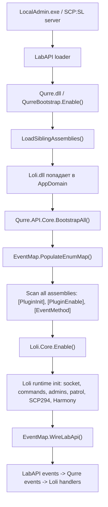
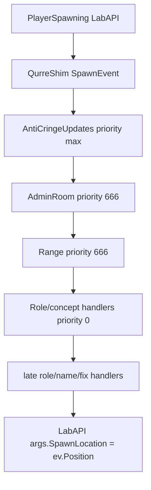
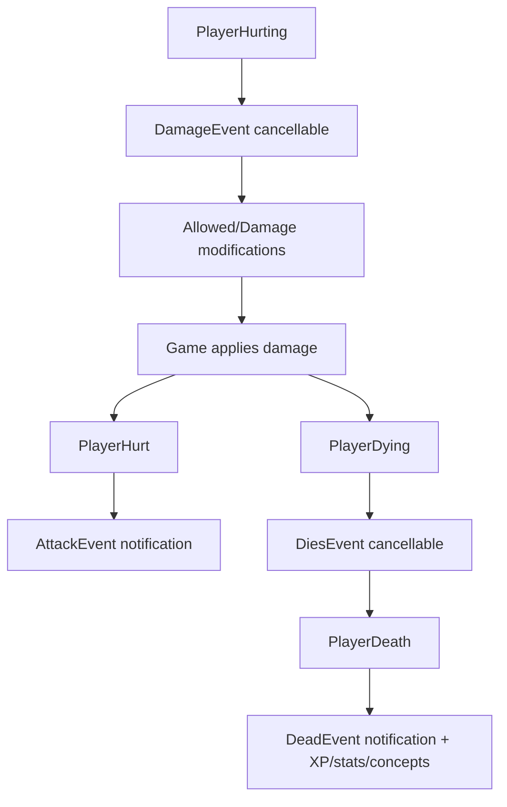

# FYDNE runtime execution map

Дата среза: 2026-06-09.

Документ описывает не "что примерно есть в проекте", а фактическую схему исполнения по текущему коду `Loli.dll` + `QurreShim`: от запуска LocalAdmin/SCP:SL до ожидания игроков, входа игрока, старта раунда, игровых событий, конца раунда и внешних интеграций.

## 1. Общая модель

FYDNE сейчас состоит из двух DLL:

- `Qurre.dll` - это не оригинальный Qurre, а `QurreShim`, LabAPI-плагин совместимости.
- `Loli.dll` - основной legacy-плагин FYDNE, скомпилированный под старый Qurre API и запускаемый через shim.

Поток:

Ключевое следствие: FYDNE не является набором отдельных LabAPI-плагинов. Это один большой Qurre-style plugin, разбитый на статические классы. "Плагинами" в практическом смысле здесь являются модули/подсистемы внутри `plugin/Loli`.

## 2. Загрузка сервера

### 2.1 LabAPI загружает shim

Файл: `plugin/QurreShim/src/Bootstrap.cs`

`QurreBootstrap : LabApi.Loader.Features.Plugins.Plugin` имеет стандартные LabAPI metadata:

- `Name = "Qurre-Shim"`
- `RequiredApiVersion = 1.1.0`

При `Enable()`:

1. `LoadSiblingAssemblies()` проходит по LabAPI plugin folders.
2. Загружает соседние DLL, включая `Loli.dll`.
3. Вызывает `Qurre.API.Core.BootstrapAll()`.

Развилка:

- Если `Loli.dll` не лежит рядом или не грузится, shim стартует, но FYDNE не регистрируется.
- Если зависимость `Loli.dll` отсутствует в LabAPI dependencies/global, будет `FileNotFoundException`/`TypeLoadException` на этапе загрузки assembly.
- Если assembly загружена, дальше все события идут через reflection registry.

### 2.2 QurreShim строит event registry

Файл: `plugin/QurreShim/src/Core.cs`

`BootstrapAll()` делает:

1. `EventMap.PopulateEnumMap()`:
   - сопоставляет старые enum/event markers Qurre с конкретными event struct типами.
   - пример: `PlayerEvents.Spawn -> SpawnEvent`, `RoundEvents.Waiting -> RoundWaitingEvent`.
2. Сканирует все assemblies в `AppDomain`.
3. Для каждого типа:
   - читает `[EventMethod(...)]`;
   - определяет event struct;
   - регистрирует handler с priority.
4. Для типов с `[PluginInit]` вызывает методы `[PluginEnable]`.
5. Подписывает реальные LabAPI events через `EventMap.WireLabApi()`.

Приоритеты:

- `list.Sort((a, b) => b.Priority.CompareTo(a.Priority))`
- большее число выполняется раньше;
- `int.MaxValue` - самый ранний handler;
- `0` - обычный handler;
- `int.MinValue` - самый поздний safety/final handler.

Развилки:

- Метод `[EventMethod]` должен быть static.
- Если у handler больше одного параметра, shim его пропускает.
- Если event type не распознан, handler не регистрируется.
- Если handler падает на runtime, `Core.Dispatch()` логирует конкретный handler и продолжает вызывать остальные.

### 2.3 Loli.Core.Enable()

Файл: `plugin/Loli/Core.cs`

На enable:

1. Создает/читает `JsonConfig("Loli")`.
2. Читает `WebHooks`.
3. Регистрирует socket callbacks:
   - `token.required`
   - `connect`
4. На socket connect вызывает:
   - `SCPServerInit`
   - `server.clearips`
   - delayed `server.addip` для уже подключенных игроков.
5. Определяет `ServerID`, `ServerName`, `DonateID`, `BlockStats` через `UpdateServers()`.
6. Запускает `UpdateVerkey()` coroutine.
7. Регистрирует RA commands:
   - `bp`
   - `backup_power`
8. Инициализирует:
   - `Patrol.Init()`
   - `Admins.Call()`
   - `Scps.Scp294.Events.Init()`
9. Запускает `PatchAllSafely()`.

Развилки:

- `FYDNE_RECOVERY_MODE` по умолчанию включен.
- `FYDNE_SOCKET_ENABLED` по умолчанию выключен. Если не включить явно, socket вызовы становятся no-op.
- Если socket включен, но backend отсутствует, `SafeSocket` должен не ронять сервер.
- Harmony patch применяется per-type: сломанный patch логируется и не останавливает остальные.

## 3. Глобальные runtime-петли

### 3.1 Cycle

Файл: `plugin/Loli/Modules/Cycle.cs`

Статический конструктор запускает постоянные coroutines:

- `Сycle()` раз в 1 секунду.
- `SlowСycle()` раз в 5 секунд.
- `BroadCasts.Send()`.
- `CountTicks()` каждый кадр.
- `CountTicksUpdate()` раз в 5 секунд.

`Сycle()` вызывает:

- `ScpHeal.Heal()`
- `Icom.Update()`
- `Fixes.FixRoundFreeze()`
- `Fixes.CheckBcAlive()`
- `Fixes.FixFreezeEnd()`
- `VoteRestart.CycleCheck()`
- `Fixes.CheckPlayersPing()` - сейчас отключается в `Core.RecoveryMode`.
- `Fixes.AntiAllFreeze()`
- MRP-only SCP rework cycles.
- `ScpHint.UpdateScps()`
- `Logo.TimeUpdate()`
- NR-only `Priest.Update1s()`.

`SlowСycle()` вызывает:

- NR-only `AutoAlpha.Check()`
- `Caches.PosCheck()`
- MRP-only SCP rework 5s cycles.

Развилки:

- Эти циклы запускаются независимо от раунда.
- Ошибки внутри отдельных вызовов глотаются `try/catch`.
- Watchdog-части (`FixRoundFreeze`, `CheckBcAlive`, `FixFreezeEnd`, `AntiAllFreeze`) могут вызвать `Extensions.RestartCrush()`.
- В recovery-mode `RestartCrush()` не должен реально перезапускать сервер.

### 3.2 TPS/socket heartbeat

`CountTicksUpdate()`:

- считает `Core.TicksMinutes = Core.Ticks / 5`;
- если `Core.ServerID != 0` и есть игроки, шлет `server.tps`.

Развилка:

- При disabled socket это no-op.
- При enabled socket backend получает имя сервера, TPS и count игроков.

## 4. Ожидание игроков

Главный event: `RoundEvents.Waiting`.

Статическая карта показывает 78 handlers. Важные группы:

- ранние build/reset handlers:
  - `Builds.Load.Waiting` priority `int.MaxValue`
  - `StationsManager.Refresh` priority `int.MaxValue`
  - `HintsCore.Worker.Waiting` priority `int.MaxValue`
  - `Hackers.Control/MainServers.Refresh` priority `int.MaxValue`
- обычные reset handlers:
  - `Waiting.WaitingMethod`
  - `AdminRoom.Load`
  - `Range.Waiting`
  - `SurfaceObjects.Load`
  - `VertPlace.Load`
  - `DataBase.*.Waiting`
  - `Scp294.Events.Waiting`
  - `Spawns.*.Refresh`
- поздние loaders:
  - `Hackers.Control.Load` priority `int.MinValue`
  - `Hackers.MainServers.Load` priority `int.MinValue`
  - concept hint refreshers priority `int.MinValue`.

### 4.1 Build layer

`Builds.Load.Waiting`:

1. Чистит `Server.Doors`.
2. Чистит `Lift.List`.
3. Убивает корутины:
   - `DoorOpenCloseInServer`
   - `ServerLightBlink`
   - `SpawnServersInServersRoom`
   - `CustomLiftRunning`
   - `TexturesChildAndNotPrefereCoroutine`
   - `NeonLightModel`
4. Через 0.5s вызывает `Initialize()`.

`Initialize()`:

- создает `Radar`;
- delayed вызывает:
  - `RadarLoc.Load()`
  - `Bashni.Load()`

Отдельные rooms на `RoundEvents.Waiting`:

- `AdminRoom.Load()` - строит старую admin/waiting room и ставит точки `TutorialSpawnPoint`, `WaitingSpawnPoint`.
- `Range.Waiting()` - строит тир/доп.зону, вычисляет `ChaosSpawnPoint`, `DonateSpawnPoint`, `VentRoom`.
- `Gate3.Load()` - строит Gate3/кастомные двери/лампы.
- `SurfaceObjects.Load()` - surface replacement objects.
- `VertPlace.Load()` - эвакуационный вертолет/лифт/зоны.

Риск текущего восстановления:

- Эти зоны используют жесткие координаты и/или схемы.
- Если схема не восстановлена или модель создана частично, игрок может попасть в воздух/за карту.
- `AdminRoom.SpawnChangePos` с priority `666` переносит Tutorial/Scp3114 в waiting/admin spawn.

### 4.2 Waiting module

Файл: `plugin/Loli/Modules/Waiting.cs`

`WaitingMethod()`:

1. `allowSpawn = true`.
2. Запускает coroutine.
3. Coroutine ждет 5 секунд.
4. Пока server waiting и timer > 1 или -2, ждет по 0.5s.
5. Если still waiting и allowSpawn:
   - `StartedClear()`
   - ждет 0.5s
   - если все еще waiting: `Round.Start()`.

`ForceStart()`:

- если `allowSpawn`, вызывает `StartedClear()`.

`StartedClear()`:

- `allowSpawn = false`;
- всем Tutorial игрокам:
  - clear inventory;
  - role = Spectator.

Развилки:

- При обычном ожидании игроки получают Tutorial через `Join` delayed 4s.
- При force-start Tutorial игроки переводятся в Spectator, дальше vanilla/game role assignment должен дать нормальную роль.
- Ранее тут была опасность double-start; она уже закрывалась.

## 5. Вход игрока

Главный event: `PlayerEvents.Join`.

Handlers: 18.

Типовая цепочка:

1. `Hints` с priority `-1` могут создать UI/blocks.
2. Обычные handlers:
   - `Caches.Join`
   - `Chat.Main.Join`
   - `FastReconnect.Join`
   - `Force.Join`
   - `RandomBuff.SendJoin`
   - `Levels.Join`
   - `Loader.Join`
   - `Another.DoSpawn/ChangeNick/BlockKids`
   - `Waiting.Join`
3. `HintsCore.Worker.Join` priority `int.MaxValue` выполняется раньше обычных в registry ordering, если событие dispatch сортирует по priority.

Важные действия:

- `Waiting.Join`:
  - показывает welcome hint;
  - через 4 секунды переводит в Tutorial, если round waiting и timer позволяет;
  - шлет `server.join` и `server.addip`.
- `Loader.Join`:
  - создает default records для `force/giveway/effect/...`;
  - вызывает `LoadData(player)`;
  - `LoadData` шлет socket `database.get.data`.
- `Levels.Join`:
  - delayed broadcast подсказок по уровню/экономике.
- `FastReconnect.Join`:
  - сейчас в recovery-mode сразу returns.
  - в боевом режиме восстанавливает роль, позицию, инвентарь после forced reconnect.
- `Another.BlockKids`/`ChangeNick`:
  - legacy moderation/name behavior.

Развилки:

- Без socket backend `Loader.LoadData` не получает user data, но SafeSocket делает no-op.
- С новым backend данные возвращаются JSON-заглушками.
- Если `FastReconnect` включить без точной совместимости `LastSynced`, возможен reconnect-loop.

## 6. Старт раунда

Главный event: `RoundEvents.Start`.

Handlers: 29.

Основные группы:

- reset/state:
  - `AdrenalineInsult.Refresh`
  - `AutoAlpha.Refresh`
  - `CustomUnits.Start`
  - `VoteRestart.RoundStart`
- gameplay spawn setup:
  - `SpawnManager.SpawnCor`
  - `RolePlay.Modules.MainGuard` priority `-2`
  - `RolePlay.Scientists.RoundStart` priority `-2`
  - `Cutscene.Init` priority `-1`
- events:
  - `AirDrop.RunAirDropCoroutine`
  - `AutoModeration.Executor.Register`
  - `Sweep.RoundStart`
  - `RealCuffs.SpawnCuffs`
  - concept starts.
- watchdog:
  - `Fixes.FixNotSpawn`.

### 6.1 SpawnManager

Файл: `plugin/Loli/Spawns/SpawnManager.cs`

`SpawnCor()`:

- `LastEnter = DateTime.MinValue`.
- запускает coroutine `SpawnTeam()`.

`SpawnTeam()`:

- бесконечно ждет random interval:
  - MRP: 200-320s
  - NR: 120-180s
- вызывает `Spawn()`.

`Spawn()`:

- если round не started, return.
- MRP first spawn может принудительно вызвать MTF.
- иначе random:
  - 50% ChaosInsurgency.SpawnCI()
  - 50% MobileTaskForces.SpawnMtf()

Развилки:

- RA `server_event respawn_mtf/respawn_ci` вызывает ручной spawn wave.
- RA `ci`/`mtf` вызывает vanilla helicopter/car.
- Spawn protection ставит tag `SpawnProtect` на 10s и блокирует damage.

### 6.2 Watchdog FixNotSpawn

Файл: `plugin/Loli/Modules/Fixes.cs`

`FixNotSpawn()`:

1. Через 1s после старта считает:
   - `pls = Player.List.Count()`
   - `pls2 = alive or overwatch count`
2. Если `pls == 0` или `pls / 1.5 > pls2`:
   - через 5s dim screen всем;
   - через 1s `RestartCrush("Не заспавнило больше половины игроков")`;
   - пытается показать round summary.

Текущий recovery branch:

- `RestartCrush` в recovery-mode блокирует реальный restart.
- Но причина "не заспавнило" остается диагностически важной: значит часть spawn pipeline не дала живую роль.

## 7. Спавн игрока

Главный event: `PlayerEvents.Spawn`.

Handlers: 43.

Особо важный порядок:

- `int.MaxValue`:
  - `AntiCringeUpdates.DontSpawnInLcz`
- `666`:
  - `AdminRoom.SpawnChangePos`
  - `Range.SpawnChangePos`
- `1`:
  - `Scientists.FixTags`
- `0`:
  - большая часть gameplay/donate/hints/SCP handlers.
- `-1`:
  - `RealDClass.RealName`
- `-2`:
  - `Scientists.Spawn`
- `int.MinValue`:
  - `CustomUnits.Spawn`
  - `Fixes.FixZombieSpawn`

Важные mutations:

- `AdminRoom.SpawnChangePos`:
  - если role Tutorial/Scp3114:
    - при waiting: `ev.Position = WaitingSpawnPoint`;
    - иначе `ev.Position = TutorialSpawnPoint`.
- `Range.SpawnChangePos`:
  - donate tag -> `DonateSpawnPoint`;
  - Chaos roles -> `ChaosSpawnPoint`.
- `Hacker.FixPos`:
  - role-specific hardcoded `ev.Position = new(128, 990, 28)`.
- `SerpentsHand.Spawn`:
  - Tutorial role can become SerpentsHand and use `new Vector3(0,302,5)`.
- `Fixes.FixZombieSpawn`:
  - if Scp0492 spawn is zero/pocket fallback, moves to doctor or Hcz049.
- `Addons.Spawn.Update`:
  - clears effects;
  - clears/sets custom info;
  - delayed 0.2s sets inventories per role.
- `DataBase.Customize`:
  - applies scale/donate customization.
- `Levels.Spawn`, hints modules:
  - stats/UI.

Current suspect chain for "spawn in air / outside map":

If any hardcoded custom area is missing/partial, `ev.Position` may be valid numerically but invalid physically.

## 8. Role change

Главный event: `PlayerEvents.ChangeRole`.

Handlers: 25.

Major consumers:

- `AdrenalineInsult` - kill/coroutine cleanup by role changes.
- `OpenSCPs` - SCP availability and replacement.
- `RPNames`, `SafeSystem`, SCP reworks - tags/custom role names.
- `CO2`, `NuclearAttack`, `SerpentsHand`, `Hackers`, `Priest` - concept roles.
- `DataBase.Customize`, `Glow`, `Nimb`, `Updater` - cosmetics/user data.
- `RealDClass`, `Scientists`, `Sweep` - RP role transformations.

Развилки:

- LabAPI `ChangingRole` is cancellable/mutable: handler may change `args.NewRole`.
- LabAPI `ChangedRole` is notification only; same Qurre `ChangeRoleEvent` is dispatched but cannot stop already-changed role.
- Some legacy handlers expect both pre and post role events and may run twice.

## 9. Damage/death

Events:

- `PlayerEvents.Damage` - 12 handlers.
- `PlayerEvents.Attack` - 9 handlers.
- `PlayerEvents.Dies` - 4 handlers.
- `PlayerEvents.Dead` - 13 handlers.

Flow:

Important branches:

- `SpawnManager.SpawnProtect` blocks damage while tag contains `SpawnProtect`.
- `Range.AntiSpawnDamage` blocks damage inside invisible/check custom areas.
- `AntiCheat` blocks selected exploits.
- SCP reworks modify SCP damage behavior.
- `Levels.XpKill`, `EndStats`, concept modules update stats and UI.
- `ScpDead`/voice modules play custom announcements.

## 10. Doors, lifts, map interactions

Events:

- `PlayerEvents.InteractDoor` - 12 handlers.
- `MapEvents.OpenDoor` - 6 handlers.
- `MapEvents.DamageDoor` - 10 handlers.
- `MapEvents.LockDoor` - 6 handlers.
- `PlayerEvents.InteractLift` - 2 handlers.
- `PlayerEvents.InteractGenerator` - 4 handlers.
- `PlayerEvents.InteractWorkStation` - 1 handler.
- `PlayerEvents.InteractLocker` - 1 handler.

Key behavior:

- `Builds.Load` blocks interactions with fake static doors named `StaticDoorNameInvisible`.
- `Builds.Models.Lift` implements custom lift/door interactions.
- `BackupPower` can block/intercept doors/lifts while hacked.
- `RolePlay.Modules` blocks SCP interactions with doors/lifts/generators under RP rules.
- `Scp008.ControlRoom/TubeRoom` locks custom doors and controls SCP-008 flow.
- `Gate3` custom door teleports player between entrance/exit points.

Risk:

- Many interactions depend on custom geometry existing in exact expected location.
- If a custom `Door`/`Lift` adapter points to fake GameObject without `NetworkIdentity`, it must go through `SafeNetwork`.

## 11. Commands

Команды регистрируются через `CommandsSystem`.

Bridge:

- `CommandType.RemoteAdmin -> RemoteAdminCommandEvent`
- `CommandType.Client -> GameConsoleCommandEvent`
- `CommandType.Console` from LocalAdmin is currently skipped in shim to avoid null-player crashes.

Important command groups:

- user/help:
  - `help`, `хелп`, `хэлп`, `kys`, `kill`, `tps`, `size`
- chat:
  - `chat`, `чат`, `чай`, positional/public/ally/team/private/clan/admin/nonrp aliases
- admin/testing:
  - `event`, `textmute`, `roundmute`, `roundff`, `picks`, `level_set`
- gameplay:
  - `s`, `force`, `res`, `079`, `escd`, `ssa`
- economy:
  - `xp`, `lvl`, `money`, `stats`, `pay`, `пей`, `пэй`
- RA:
  - `bp`, `backup_power`, `list`, `stafflist`, `ob`, `oban`, `hidetag`, `bring`, `ban`, `ow`, `audio`, `hacker`, `server_event`, `ci`, `mtf`

Развилка:

- Many commands set `ev.Allowed = false` because they consume the command and write custom `Reply`.
- Donate RA handler intercepts vanilla `give`, `forceclass`, `pfx` by checking `ServerEvents.RemoteAdminCommand`.

## 12. Socket/backend

Socket events emitted by Loli:

- lifecycle:
  - `SCPServerInit`
  - `server.clearips`
  - `server.addip`
  - `server.join`
  - `server.leave`
  - `server.tps`
- database:
  - `database.get.data`
  - `database.get.stats`
  - `database.add.stats`
  - `database.add.time`
  - `database.get.donate.roles`
  - `database.get.donate.customize`
  - `database.get.donate.ra`
  - `database.get.nitro`
  - `database.get.patrol`
  - `database.get.adm.steams`
  - `server.database.clans`
  - `database.internal.unsafe.set_level`
  - `database.remove.admin`
  - `database.admin.ban`
  - `database.admin.kick`

Socket events consumed by Loli:

- `connect`
- `token.required`
- `SCPServerInit`
- `socket.database.clans`
- `database.get.data`
- `database.get.stats`
- `database.update.zero.money`
- `database.get.donate.customize`
- `database.get.nitro`
- `database.get.donate.roles`
- `database.get.donate.ra`
- `database.get.patrol`
- `database.get.adm.steams`
- `ChangeFreezeSCPServer`

Развилка:

- Новый `backend/fydne-socket` intentionally JSON-first and partial.
- Кланы сейчас возвращаются пустыми, чтобы не дергать старый HTTP API.
- Полная экономика/донат/статистика зависит от восстановления реальных данных или новой базы.

## 13. Уведомления игрокам и внешние оповещения

Типы:

- `Client.ShowHint` - короткие уведомления на экране.
- `Client.Broadcast` / `Map.Broadcast` - broadcast игроку или всему серверу.
- `Client.SendConsole` - game console text.
- `RemoteAdminCommandEvent.Reply` / `RaReply` - RA replies.
- `Dishook` - Discord webhook.
- `Telegram` - Telegram HTTP call.

Главные источники:

- `Waiting.Join` - приветствие FYDNE.
- `Levels` - XP/money/level/pay feedback.
- `Chat.Main/Cmd` - текстовый чат и ошибки ввода.
- `Scp294.Events/Drinks` - покупка напитков и эффекты.
- `Ragnarok.Priest` - priest/believe/pray replies и role broadcast.
- `Hackers`, `CO2`, `NuclearAttack`, `Scp008` - role/concept broadcasts.
- `Admins` - ban/kick broadcast.
- `Reports` - report hints + webhook.
- `AutoModeration`/`AntiCheat` - webhook logs.
- `AutoAlpha`, `OmegaWarhead`, `BackupPower`, `MainServers` - global event broadcasts.

## 14. End/restart

`RoundEvents.End` handlers:

- stop air drop;
- unregister automod;
- show end stats;
- kill build coroutines;
- add XP for round end;
- flush database time/stats;
- clear IPs;
- clear items/end refresh;
- run `FixFastEnd`;
- stop spawn manager coroutine.

`RoundEvents.Restart` handlers:

- unregister automod;
- refresh station/hacker/scp008 state;
- clear delayed connection patch state;
- destroy Scp008 ControlRoom if needed.

Risk:

- `PluginDisable` currently calls `Server.Restart()`. This is legacy behavior and dangerous if LabAPI disables plugin during reload.
- `RestartCrush` was made recovery-safe, but production policy must decide which watchdogs are valid.

## 15. Current critical recovery branches

### Branch A: server starts, no players

Expected:

- LabAPI loads QurreShim.
- QurreShim loads Loli.
- Harmony skips broken patches but server reaches waiting.
- No TypeLoad/MissingMethod/NRE flood.

Current status: mostly passing.

### Branch B: player joins waiting

Expected:

- user sees welcome hint;
- socket data loads or no-op fallback;
- after 4s player becomes Tutorial;
- AdminRoom moves Tutorial to waiting point.

Current risks:

- AdminRoom custom geometry may be incomplete.
- Waiting point may be physically invalid.
- Data may be default because backend is replacement-first.

### Branch C: force-start one player local

Expected in recovery:

- Tutorial player converted to Spectator;
- vanilla round start assigns playable role;
- RoundCheck does not end solo round;
- FixNotSpawn may warn, but no restart;
- FastReconnect must not reconnect player.

Current fixes:

- solo round end blocked in recovery.
- restart blocked in recovery.
- FastReconnect disabled in recovery.

Next risk:

- actual spawn position handlers still may move player into invalid custom zones.

### Branch D: public multi-player restoration

Required before public:

- decide whether AdminRoom waiting area is restored or disabled/rebuilt;
- restore real backend state;
- replace JSON socket with persistent DB;
- audit every hardcoded coordinate;
- decide which Harmony patches are worth porting;
- disable recovery-mode and re-enable only production-safe watchdogs.

