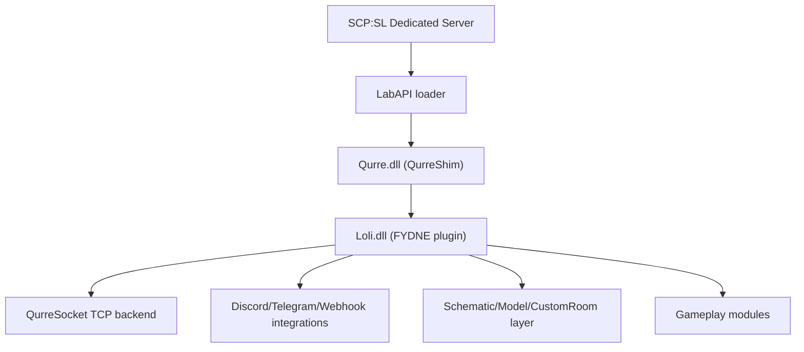
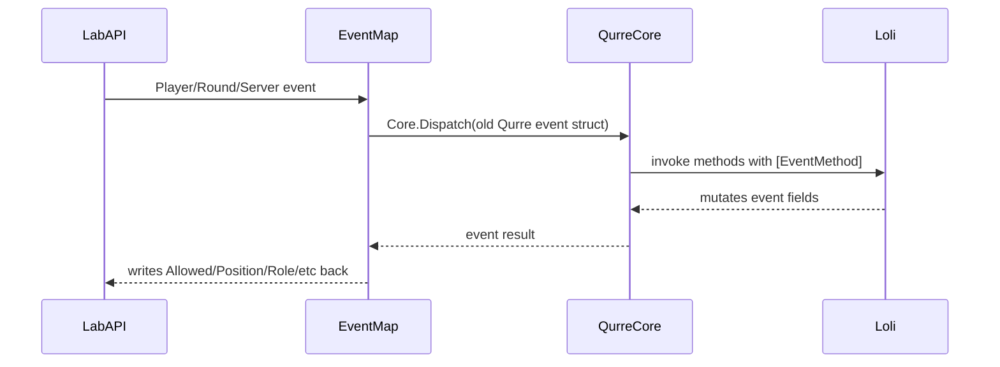

# Архитектура FYDNE Recovery

Документ фиксирует текущее понимание проекта FYDNE/Loli после переноса на LabAPI через `QurreShim`.

Цель документа: дать карту модулей, событий, команд, внешних зависимостей и runtime-рисков, чтобы восстановление шло системно, а не только по одному crash-логу.

## Текущее состояние тестов

Последний локальный тест после отключения auto-restart показал:

- Сервер больше не перезапускается сам из-за старого watchdog.
- `idle_mode_enabled` в локальном `config_gameplay.txt` выключен.
- При `forcestart` срабатывает старый watchdog `FixNotSpawn`, но `RecoveryMode` блокирует рестарт:
  - `RecoveryMode: blocked server restart: Не заспавнило больше половины игроков`
- Через несколько минут после старта появляется massive exception flood:
  - `RuntimeBinderException: Cannot implicitly convert type 'UnityEngine.Vector3' to 'UnityEngine.Quaternion'`
  - источник: `Loli.FixOnePrimitiveSmoothing.Update`
  - количество в одном логе: более 37 000 повторов.

Исправлено в коде:

- `FixOnePrimitiveSmoothing` теперь пишет `Primitive.Base.NetworkRotation = Quaternion.Euler(Primitive.Rotation)`.
- При уничтоженном/невалидном primitive компонент отключает себя и не спамит исключениями.
- Исправление собрано, развернуто и запушено коммитом `c1d0b0c`.
- После следующего пользовательского теста найден вероятный отдельный источник "кика" через несколько секунд: старая эвристика `Fixes.CheckPlayersPing()` принимала `Player.LastSynced > 1s` за зависшего клиента и вызывала `FastReconnect.Process()`, который делал `pl.Client.Reconnect()` и временно переносил игрока в `Vector3.zero`.
- В recovery-mode этот механизм отключен: `CheckPlayersPing()`, `FastReconnect.Join()` и `FastReconnect.Process()` больше не запускают legacy auto-reconnect.
- Текущая локальная DLL после этой правки: `Loli.dll` SHA256 `DA0873FFD6BF593127FF0AEEA5516F8950764AC449E80FA1F16B69BC98E0F4F6`.

Следующий тест должен подтвердить, что exception flood исчез и reconnect-loop больше не срабатывает. Если игрока продолжит выкидывать, следующий слой проблемы надо искать уже в spawn/role pipeline, а не в smoothing/FastReconnect.

## Слои системы

## Загрузочная схема

### `QurreShim`

`QurreShim` компилируется в файл `Qurre.dll`, потому что старый `Loli.dll` ожидает assembly с именем `Qurre`.

Основные файлы:

- `plugin/QurreShim/src/Bootstrap.cs` - LabAPI plugin entrypoint. Загружает соседние DLL и вызывает инициализацию shim.
- `plugin/QurreShim/src/Core.cs` - сканирует assembly на `[PluginInit]`, `[PluginEnable]`, `[PluginDisable]`, `[EventMethod]`.
- `plugin/QurreShim/src/EventMap.cs` - переводит LabAPI events в старые Qurre event structs.
- `plugin/QurreShim/src/Structs/Structs.cs` - legacy-compatible event-классы.
- `plugin/QurreShim/src/Player.cs` и `PlayerSubObjects.cs` - обертки над `LabApi.Features.Wrappers.Player`.
- `plugin/QurreShim/src/Addons/Models.cs`, `Schematic.cs`, `SchematicJsonLoader.cs` - частичная замена старого Qurre/SchematicUnity model API.

Event flow:

### `Loli.dll`

`Loli` - основной FYDNE plugin.

Главная точка:

- `plugin/Loli/Core.cs`

На enable:

- читает env/config;
- поднимает `SafeSocket`;
- регистрирует socket callbacks;
- регистрирует базовые RA-команды `bp`, `backup_power`;
- инициализирует patrol/admin/scp294;
- запускает `PatchAllSafely()`, который пытается применить Harmony-патчи по всем типам assembly.

Recovery-переменные:

- `FYDNE_RECOVERY_MODE=1` - локальный режим восстановления. Сейчас включен по умолчанию.
- `FYDNE_SOCKET_ENABLED=1` - включает QurreSocket backend.
- `FYDNE_SOCKET_IP=127.0.0.1` - адрес socket backend.
- `FYDNE_API_URL`, `FYDNE_API_TOKEN`, `FYDNE_CDN_URL` - старые внешние API/CDN, сейчас в основном пустые.

## Структура проекта

Количество `.cs` файлов по крупным папкам:

| Папка | Назначение | Файлов |
|---|---:|---:|
| `Addons` | команды, чат, донатные фичи, fast reconnect, airdrop, anti-cheat, moderation | 54 |
| `Scps` | rework/улучшения SCP и SCP-294 drinks | 37 |
| `Concepts` | крупные игровые события: CO2, Hackers/Omega, NuclearAttack, Ragnarok, Scp008 | 19 |
| `Patches` | Harmony patches и legacy fixes | 17 |
| `Builds` | кастомные объекты, комнаты, лифты, двери, props | 13 |
| `DataBase` | socket-driven user/admin/donate/stats state | 13 |
| `Modules` | core gameplay cycle, waiting, round check, fixes, cleanup, voices | 13 |
| `HintsCore` | кастомный hint UI | 12 |
| `Logs` | reports/bans/log rewrite | 5 |
| `Spawns` | MTF/CI/custom spawn waves | 3 |
| `Webhooks` | Discord/Telegram helpers | 3 |

## Event architecture

Проект почти полностью событийный. Подтвержденные counts по `[EventMethod]`:

| Event | Count | Значение |
|---|---:|---|
| `RoundEvents.Waiting` | 77 | основной pre-round bootstrap: схемы, кэши, reset state, waiting room, hints |
| `PlayerEvents.Spawn` | 42 | кастомные спавны, донат-эффекты, роли, hints, admin room |
| `RoundEvents.Start` | 23 | старт раунда, spawn manager, airdrop, automod, custom units |
| `PlayerEvents.ChangeRole` | 22 | роль/префиксы/донат/спецроли |
| `PlayerEvents.Join` | 18 | загрузка данных, waiting/tutorial, chat/hints |
| `RoundEvents.End` | 13 | stats, cleanup, end hints, watchdog |
| `PlayerEvents.Dead` | 13 | XP/stats/custom team logic |
| `PlayerEvents.Damage` | 12 | anti-cheat, custom SCP, custom rooms |
| `PlayerEvents.InteractDoor` | 12 | backup power, roleplay restrictions, custom doors |
| `PlayerEvents.Attack` | 9 | stats, custom damage, concepts |
| `RoundEvents.Restart` | 8 | cleanup of concepts and custom systems |
| `ServerEvents.RemoteAdminCommand` | 8 | custom RA commands, admin/patrol control |

Вывод: FYDNE не является одним monolithic plugin. Это набор подсистем, связанных через Qurre events, shared static state и socket/database cache.

## Основной lifecycle

### Waiting phase

Ключевые файлы:

- `plugin/Loli/Modules/Waiting.cs`
- `plugin/Loli/Builds/Load.cs`
- `plugin/Loli/Modules/Cycle.cs`
- `plugin/Loli/DataBase/Modules/Loader.cs`
- `plugin/Loli/Builds/Models/Rooms/AdminRoom.cs`
- `plugin/Loli/Builds/Models/Rooms/Range.cs`

Что должно происходить:

1. Игрок заходит.
2. `Loader.Join` запрашивает user data через socket.
3. `Waiting.Join` через несколько секунд переводит игрока в `Tutorial`, если раунд еще waiting.
4. Admin/waiting room логика должна телепортировать Tutorial игроков в отдельную зону ожидания.
5. `Builds.Load.Waiting` очищает старые custom doors/lifts/coroutines и создает часть кастомных объектов.
6. При `ForceStart` waiting-игроки возвращаются в spectator/normal spawn flow.

Текущий риск:

- Старая FYDNE waiting/admin-zone была завязана на схемы и позиции вне карты.
- Если custom room/schematic восстановлены не полностью, игрок может появиться в воздухе/за картой.
- `FixNotSpawn` считает такой старт аварией и пытается рестартить сервер. В recovery-mode рестарт заблокирован, но сама причина остается.

### Round start

Ключевые файлы:

- `plugin/Loli/Spawns/SpawnManager.cs`
- `plugin/Loli/Spawns/MobileTaskForces.cs`
- `plugin/Loli/Spawns/ChaosInsurgency.cs`
- `plugin/Loli/Addons/Spawn.cs`
- `plugin/Loli/Addons/Force.cs`
- `plugin/Loli/Modules/RoundCheck.cs`
- `plugin/Loli/Modules/Fixes.cs`

Что должно происходить:

1. На старте раунда vanilla SCP:SL раздает роли.
2. FYDNE перехватывает spawn/change role events.
3. Модули меняют роли, позиции, кастомные команды и ограничения.
4. Custom spawn waves добавляют MTF/CI/Hacker/CO2/Ragnarok/SerpentsHand сценарии.
5. `RoundCheck` переопределяет условия победы.

Текущий риск:

- Solo/local test не похож на боевой сервер, поэтому watchdog-и и spawn проверки дают false positive.
- Некоторые spawn позиции жестко зашиты: `AdminRoom`, `Range`, `Hacker`, `Gate3`, `Scp008`.
- Если соответствующая custom geometry не создана, teleport может отправить игрока за карту.

## Команды

### Client/game console commands

Команды регистрируются через `CommandsSystem.RegisterConsole`.

Группы:

- Help/basic:
  - `help`, `хелп`, `хэлп`
  - `kys`, `kill`
  - `tps`
  - `size`
- Admin/testing:
  - `event`
  - `textmute`
  - `roundmute`
  - `roundff`
  - `picks`
  - `level_set`
- Chat:
  - `chat`, `чат`
  - `чай`
  - `б`, `ближний`, `pos`
  - `п`, `пб`, `публичный`, `public`
  - `с`, `сз`, `союзный`, `ally`
  - `к`, `км`, `командный`, `team`
  - `л`, `лс`, `личный`, `private`
  - `кл`, `клан`, `clan`
  - `ад`, `адм`, `admin`
  - `нрп`, `нонрп`, `nonrp`
- Gameplay:
  - `s`
  - `force`
  - `rc`
  - `res`
  - `079`
  - `co2group`
  - `escd`
  - `ssa`
- RPG/Ragnarok:
  - `priest`, `pri`, `св`
  - `believe`, `bel`, `уверовать`
  - `pray`, `пр`, `призыв`
- Economy/stats:
  - `xp`, `lvl`, `money`, `stats`
  - `pay`, `пей`, `пэй`
- Reports:
  - `bug`, `bag`, `баг`

### RemoteAdmin commands

Команды регистрируются через `CommandsSystem.RegisterRemoteAdmin`.

- `bp`, `backup_power`
- `list`, `stafflist`
- `server_event`
- `ci`
- `mtf`
- `hacker`
- `ow`
- `audio`
- `ob`, `oban`
- `hidetag`
- `bring`, `ban`

Важная правка recovery:

- LocalAdmin server-console commands больше не отправляются в legacy `GameConsoleCommandEvent`.
- Это нужно, потому что старые handlers ожидают `ev.Player`, а у LocalAdmin command sender игрока нет.

## Socket/backend contract

FYDNE использует `QurreSocket` как главный канал к backend.

Основные исходящие события:

- `SCPServerInit`
- `server.clearips`
- `server.addip`
- `server.join`
- `server.leave`
- `server.tps`
- `server.database.clans`
- `database.get.data`
- `database.get.stats`
- `database.add.stats`
- `database.add.time`
- `database.get.donate.roles`
- `database.get.donate.customize`
- `database.get.donate.ra`
- `database.get.nitro`
- `database.get.patrol`
- `database.get.adm.steams`
- `database.remove.admin`
- `database.admin.ban`
- `database.admin.kick`
- `database.internal.unsafe.set_level`

Основные входящие события:

- `connect`
- `token.required`
- `SCPServerInit`
- `socket.database.clans`
- `database.get.data`
- `database.get.stats`
- `database.update.zero.money`
- `database.get.donate.customize`
- `database.get.nitro`
- `database.get.donate.roles`
- `database.get.donate.ra`
- `database.get.patrol`
- `database.get.adm.steams`
- `ChangeFreezeSCPServer`

Recovery backend:

- `backend/fydne-socket/server.js`
- JSON storage: `backend/fydne-socket/data/store.json`
- Это временная совместимая замена старого backend, не финальная production БД.

## Data/cache layer

Ключевые файлы:

- `plugin/Loli/DataBase/Module.cs`
- `plugin/Loli/DataBase/Modules/Data.cs`
- `plugin/Loli/DataBase/Modules/Loader.cs`
- `plugin/Loli/DataBase/Modules/Stats.cs`
- `plugin/Loli/DataBase/Modules/Updater.cs`
- `plugin/Loli/DataBase/Modules/Admins.cs`
- `plugin/Loli/DataBase/Modules/Donate.cs`
- `plugin/Loli/DataBase/Modules/Patrol.cs`
- `plugin/Loli/DataBase/Customize.cs`

Назначение:

- `Data.Users` - runtime user profiles.
- `Data.Roles` - donate/custom role flags.
- `Data.Donates` - донатные RA/gameplay permissions.
- `Data.Clans` - clan membership/boosts.
- `Stats` - сбор и отправка статистики.
- `Updater` - учет времени/сессий.
- `Admins` - admin list, whitelist/reserve, ban/kick audit.
- `Patrol` - отдельный trust/admin workflow.

Текущий риск:

- Большая часть модулей предполагает, что backend всегда ответит валидным JSON.
- Recovery backend сейчас возвращает безопасные defaults, но не весь production semantics.
- Внешний `Core.APIUrl` для clan API сейчас пустой, поэтому clan logic должна быть отключена или защищена.

## Gameplay subsystems

### Build/custom geometry

Ключевые файлы:

- `Builds/Load.cs`
- `Builds/Models/Lift.cs`
- `Builds/Models/Server.cs`
- `Builds/Models/Radar.cs`
- `Builds/Models/Rooms/AdminRoom.cs`
- `Builds/Models/Rooms/Range.cs`
- `Builds/Models/Rooms/Gate3.cs`
- `Builds/Models/Rooms/VertPlace.cs`
- `Builds/Models/SafeNetwork.cs`

Функция:

- строит custom doors, lifts, radar, admin/waiting areas, range, surface props;
- синхронизирует AdminToys/Primitive movement;
- заменяет часть старой SchematicUnity логики.

Текущий риск:

- Именно этот слой сейчас наиболее опасен для spawn/position bugs.
- Часть старых схем потеряна, поэтому геометрия восстановлена частично.
- Ошибка `FixOnePrimitiveSmoothing` была в этом слое.

### Spawns/waves

Ключевые файлы:

- `Spawns/SpawnManager.cs`
- `Spawns/MobileTaskForces.cs`
- `Spawns/ChaosInsurgency.cs`

Функция:

- управляет custom waves;
- RA-команды `ci`, `mtf`, `server_event`;
- Hacker/CO2/Serpents/Ragnarok hooks.

Текущий риск:

- В одиночном тесте часть wave logic не имеет нормального состава игроков.
- Нужно отделить production spawn logic от recovery/solo mode.

### Concepts

Крупные сценарии:

- `Concepts/CO2.cs` - CO2 event/concept.
- `Concepts/Hackers/*` - hacker role, main server panels, omega warhead/control room.
- `Concepts/NuclearAttack/*` - nuclear attack scenario.
- `Concepts/Ragnarok/Priest.cs` - priest/believer mechanics.
- `Concepts/Scp008/*` - SCP-008 rooms/control/tubes/SerpentsHand.

Текущий риск:

- Почти все concepts завязаны на custom geometry, sounds, hints, roles and timers.
- Для recovery их надо включать по одному, после стабилизации base round.

### SCP modules

Ключевые файлы:

- `Scps/Scp0492Better.cs`
- `Scps/Scp079Better.cs`
- `Scps/Better914.cs`
- `Scps/Scp294/*`
- `Addons/RolePlay/Scp096Rework.cs`
- `Addons/RolePlay/Scp106Rework.cs`
- `Addons/RolePlay/Scp173Rework.cs`

Функция:

- rework SCP abilities;
- drinks for SCP-294;
- generator/079 behavior;
- custom SCP recontainment and door interactions.

Текущий риск:

- SCP role APIs сильно менялись между версиями SCP:SL.
- Нужны отдельные runtime тесты на каждую SCP role.

### UI/Hints/Chat

Ключевые файлы:

- `HintsCore/*`
- `Addons/Hints/*`
- `Addons/Chat/*`

Функция:

- custom hint layout;
- waiting UI;
- main info/logo;
- end stats;
- SCP hints;
- text chat modes.

Текущий риск:

- Обычно не должен крашить сервер, но может спамить exceptions при неверных wrappers/player state.

### Logs/Webhooks/Moderation

Ключевые файлы:

- `Logs/Bans.cs`
- `Logs/Reports.cs`
- `Logs/RewriteGlobals.cs`
- `Addons/AutoModeration/*`
- `Addons/AntiCheat.cs`
- `Addons/CrashProtect.cs`
- `Modules/AntiCrash.cs`
- `Webhooks/Dishook.cs`
- `Webhooks/Telegram.cs`

Функция:

- Discord/Telegram webhook reports;
- moderation alerts;
- anti-crash protection against dangerous RA usage;
- AI moderation metadata.

Текущий recovery статус:

- `AutoModeration` отключен в `FYDNE_RECOVERY_MODE=1`.
- Webhook URLs берутся из env и при пустом значении не должны отправляться.
- Некоторые anti-crash modules могут disconnect/ban admin при неверной классификации. Их надо отдельно аудировать перед public launch.

## Recovery-mode policy

Сейчас `FYDNE_RECOVERY_MODE=1` должен:

- разрешать solo/local тесты;
- блокировать auto-restart watchdog-и;
- не запускать внешнюю AI moderation;
- не отправлять LocalAdmin console commands в legacy player command handlers;
- гасить заведомо неполные backend/socket зависимости.

Что уже сделано:

- `RestartCrush` в recovery-mode только логирует, но не рестартит.
- `AutoModeration.Executor.Register` не стартует в recovery-mode.
- `RoundCheck` и `QurreShim.EventMap` блокируют premature round end for solo.
- `SafeSocket` делает socket optional.
- `SafeNetwork` предотвращает spawn объектов без `NetworkIdentity`.
- `FixOnePrimitiveSmoothing` исправлен против `Vector3 -> Quaternion` runtime flood.

## Главные runtime-риски

1. Spawn/position pipeline.
   - Файлы: `Waiting.cs`, `AdminRoom.cs`, `Range.cs`, `Hacker.cs`, `Gate3.cs`, `FastReconnect.cs`.
   - Симптомы: spawn в воздухе, за картой, disconnect после spawn.

2. Custom geometry/model layer.
   - Файлы: `Builds/*`, `QurreShim/Addons/Models.cs`, `QurreShim/Addons/Schematic*.cs`.
   - Симптомы: runtime binder exceptions, missing scripts, invalid toy sync, non-networked object spawn.

3. Watchdog/anti-crash layer.
   - Файлы: `Modules/Fixes.cs`, `Patches/FixDelayed.cs`, `Addons/CrashProtect.cs`, `Modules/AntiCrash.cs`.
   - Симптомы: self-restart, disconnect, ban/kick false positives.

4. Backend/user data layer.
   - Файлы: `DataBase/Modules/*`, `backend/fydne-socket`.
   - Симптомы: missing roles, empty donate state, RA не выдается, null data.

5. Harmony patches.
   - Файлы: `Patches/*`, nested patches in addons.
   - Текущие warnings:
     - `HideRaAuth`: transpiler error `Index - 0 < 0`.
     - `AutoModeration.SaveLogs`: target method patch skipped.

## Практический порядок восстановления

1. Стабилизировать base round без concepts.
   - Цель: зайти, `forcestart`, не выкидывает, нет exception flood, можно ходить по facility.

2. Изолировать spawn/admin-room logic.
   - Временно отключить teleport в потерянные зоны или заменить на безопасный vanilla room.
   - Разобрать `AdminRoom`, `Range`, `Waiting`, `FastReconnect`.

3. Проверить custom geometry.
   - Включать `Builds` по частям.
   - Все missing schematics заменить native AdminToy models или JSON схемами.

4. Восстановить backend semantics.
   - Расширить `backend/fydne-socket` под реальные user roles/admin/patrol/donate.
   - Потом заменить JSON на SQLite/PostgreSQL.

5. Включать gameplay modules группами.
   - Basic commands/chat/hints.
   - Stats/levels.
   - Spawns.
   - SCP modules.
   - Concepts.
   - Moderation/webhooks.

6. Перед public launch отключить recovery-mode.
   - `FYDNE_RECOVERY_MODE=0`.
   - Вернуть production watchdog policy, но только после проверки, что watchdog-и больше не дают false positives.

## Что проверять после следующего теста

После перезапуска сервера и нового `forcestart` в логе не должно быть:

- `RuntimeBinderException`
- `FixOnePrimitiveSmoothing.Update`
- `Server has entered the idle mode`
- `Restarting the server`
- `GameConsoleCommandEvent::Loli.Addons.Commands.Console`
- `AutoModeration.Executor.PullMetadata`

Если игрока снова выкидывает, искать:

- `disconnect`
- `kicked`
- `timed out`
- `role`
- `spawn`
- `SetNew`
- `Position`
- `FastReconnect`
- `AdminRoom`
- `Range`

Следующий вероятный участок для фикса: `Waiting/AdminRoom/Range/FastReconnect` spawn-position flow.
